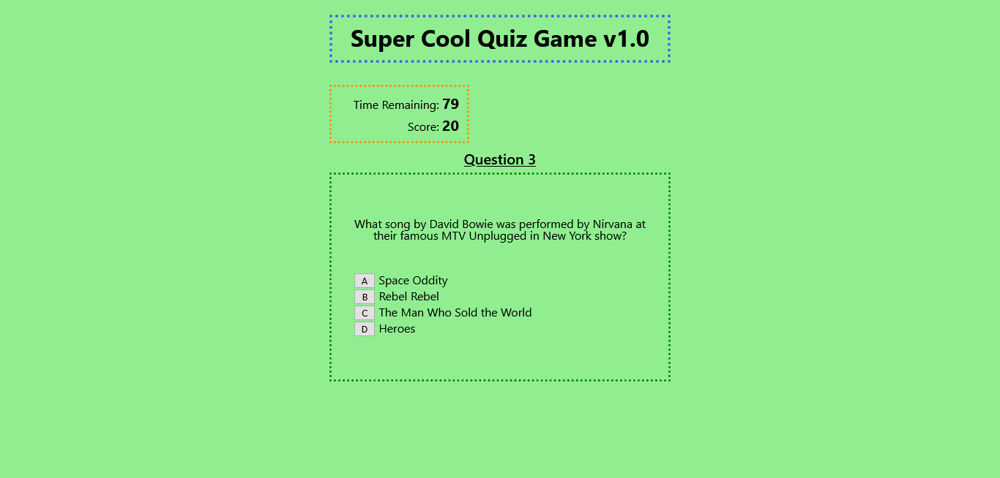
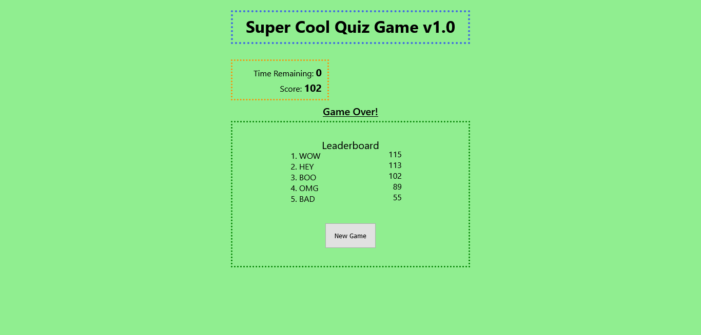

# super-cool-quiz-game

## Description
This is a simple quiz game created only with raw HTML, CSS, and JavaScript. These questions are music-themed, based on artists I am a fan of. You have 90 seconds to answer 10 multiple-choice questions; you gain 10 points for a correct answer and lose 10 seconds of time for an incorrect answer. Press the `New Game` button to start the game. At the end (triggered by either running out of time or answering the final question), you are awarded a bonus point for every 5 seconds of time remaining. Once your final score is totaled, you may enter your initials in a text box which will then bring up a leaderboard of the top 5 scores. These scores are saved on your browser's local storage. After looking at the top scores, you may press the new game button to try again for a better score.

There are a few alignment issues (most evident on a small viewport width) that I hope to fix soon.

## Live Link
https://mattyp1007.github.io/super-cool-quiz-game/

## Screenshots
Note: There are some timed elements which cannot be demonstrated with screenshots. Visit the live site to see them in effect.
### First screen

### Question Screen

### Enter Initials Screen

### Leaderboard Screen

